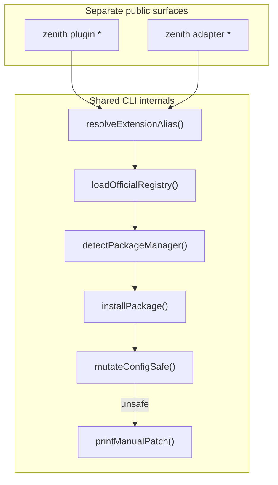
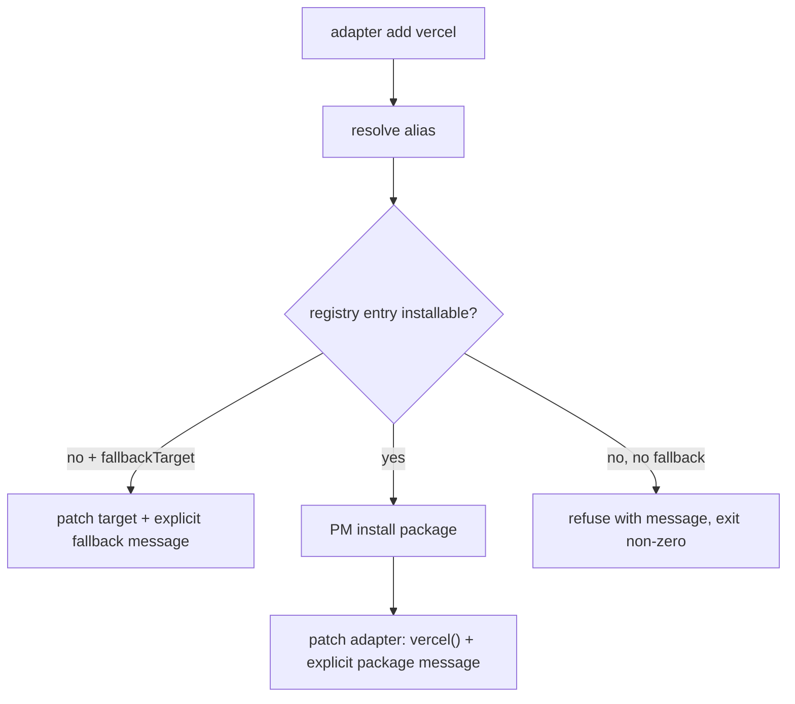

# Zenith CLI Plugin + Adapter Integration Plan

**Status: Approved — implement as separate Composer slices (M1–M7)**

> **For Composer:** use **only** the [M1 handoff](#m1-handoff-copy-paste) section below. Everything else in this document is planning context for M2–M7 — not permission to implement them.

## Context (repo-grounded)

Today `[packages/cli/src/index.js](packages/cli/src/index.js)` only routes `dev | build | preview`. Plugins are **config-time V1** only (`[config-plugins.js](packages/cli/src/config-plugins.js)`); adapters are **built into CLI** (`[resolve-adapter.ts](packages/cli/src/adapters/resolve-adapter.ts)`). There is **no config writer**, **no PM detection in CLI**, and **no `@zenithbuild/plugin-`* / `@zenithbuild/adapter-*` packages**.

Contracts currently **forbid** installer commands (`[CLI_CONTRACT.md](packages/cli/CLI_CONTRACT.md)`, `[extension-contract.md](docs/documentation/contracts/extension-contract.md)`, `[public-contract-truth.spec.js](packages/cli/tests/public-contract-truth.spec.js)`). Adding `zenith plugin` / `zenith adapter` namespaces is an intentional **contract revision** — contract docs must update **before or with M1**, not after M6.

**Binary note:** shipped bin is `zenith` (`[packages/core/bin/zenith.js](packages/core/bin/zenith.js)`). Plan uses `zenith plugin add` / `zenith adapter add` as the canonical surface.

**Locked constraints:**

- `zenith plugin` and `zenith adapter` stay **separate command trees** in v1.
- **Composer must not invent runtime plugin hooks.** If a hook does not already exist in the framework, document it as blocked/future instead of implementing it.
- Composer must preserve existing `dev` / `build` / `preview` behavior and must not refactor unrelated CLI internals.
- **No `@zenithbuild/plugin-api` package in Phase 0–1.** That name is reserved for when real runtime plugin hooks exist. Use `packages/extension-registry/src/types.ts` instead.

---

## Composer slices (M1–M7)

Each slice is a **separate Composer task/PR**. Composer must stop after each slice.


| Slice  | Scope                                                                                                                             | Exit report                          |
| ------ | --------------------------------------------------------------------------------------------------------------------------------- | ------------------------------------ |
| **M1** | Extension registry manifest + read-only CLI (`list`, `search`, `info`, `adapter list`) + contract revision for read-only commands | Changed files, tests, contract drift |
| **M2** | Lockfile-aware PM detection + `add --dry-run` (no file writes)                                                                    | Changed files, tests                 |
| **M3** | Safe config patcher (ESM/CJS rules, identifier collision)                                                                         | Changed files, fixture tests         |
| **M4** | Real install flow for `installable: true` entries + `loadConfig()` validation                                                     | Changed files, tests                 |
| **M5** | Adapter `installable` / `fallbackTarget` modes (registry-driven)                                                                  | Changed files, tests                 |
| **M6** | Conservative `plugin remove`                                                                                                      | Changed files, tests                 |
| **M7** | Final contract/docs (`add`/`remove`, README, full truth tests)                                                                    | Changed files, docs                  |


### M1 handoff (copy-paste)

Send this to Composer as the **entire** task — nothing more from this plan:

```txt
Implement only M1 from .cursor/plans/cli_plugin_adapter_commands_a11c0924.plan.md.

Scope:
- Add @zenithbuild/extension-registry manifest and minimal metadata types.
- Add read-only CLI commands:
  - zenith plugin list
  - zenith plugin search <term>
  - zenith plugin info <name|alias>
  - zenith adapter list
- Update contracts needed for these read-only commands.
- Add tests for registry loading, alias resolution, list/search/info behavior, and ensuring read-only commands do not import or execute extension package entrypoints.

Hard constraints:
- Do not implement plugin add.
- Do not implement adapter add.
- Do not implement plugin remove.
- Do not add package-manager detection.
- Do not add install logic.
- Do not add config patching.
- Do not add scaffolding commands.
- Do not create @zenithbuild/plugin-api.
- Do not invent runtime plugin hooks.
- Do not refactor dev/build/preview routing beyond adding the new command namespaces.
- Keep files under the 500-line cap.

Stop after M1 and report:
- changed files
- tests added
- contracts updated
- any contract drift or blocked hooks discovered
```

### M1 acceptance criteria (review after Composer returns)

M1 passes only if **all** are yes:

- [ ] Only read-only commands were added (`list`, `search`, `info`, `adapter list`)
- [ ] No install logic or config mutation was added
- [ ] No `@zenithbuild/plugin-api` package was created
- [ ] Read-only commands do not import or execute extension package entrypoints
- [ ] Tests prove alias resolution and registry behavior
- [ ] Contracts/docs match the new read-only command surface
- [ ] No unrelated CLI refactors (`dev` / `build` / `preview` unchanged beyond namespace routing)

If all pass, M1 is good. Review M2 separately — do not batch with M1.

---

## Architecture




### Territory map (federation-safe)


| Package                                             | Territory                         | Owns                                                         |
| --------------------------------------------------- | --------------------------------- | ------------------------------------------------------------ |
| `[packages/cli](packages/cli)`                      | `@zenithbuild/cli`                | Command routing, PM install, config mutation, user messaging |
| `packages/extension-registry` (new)                 | `@zenithbuild/extension-registry` | Manifest JSON, alias tables, `src/types.ts` metadata types   |
| `packages/plugins/*`, `packages/adapters/*` (later) | first-party extensions            | Package implementations                                      |
| `@zenithbuild/plugin-api` (later)                   | earned when runtime hooks ship    | Full plugin runtime API — **not Phase 0–1**                  |


CLI reads bundled registry metadata only — **no npm registry checks at runtime**. **Never executes discovered package entrypoints** during `list` / `search` / `info`.

---

## Extension registry (Phase 0a)

Package layout:

```txt
packages/extension-registry/
  registry.json
  src/types.ts
  src/manifest.ts
  package.json
```

### Registry entry schema

CLI behavior is **deterministic from the bundled manifest**. Do not hit npm to detect publish state.

```json
{
  "schemaVersion": 1,
  "packages": [
    {
      "name": "@zenithbuild/adapter-vercel",
      "type": "adapter",
      "alias": "vercel",
      "official": true,
      "installable": false,
      "fallbackTarget": "vercel",
      "displayName": "Vercel Adapter",
      "description": "Builds Zenith apps for Vercel deployment."
    },
    {
      "name": "@zenithbuild/adapter-netlify",
      "type": "adapter",
      "alias": "netlify",
      "official": true,
      "installable": false,
      "fallbackTarget": "netlify"
    },
    {
      "name": "@zenithbuild/plugin-image",
      "type": "plugin",
      "alias": "image",
      "official": true,
      "installable": false,
      "displayName": "Image Plugin"
    },
    {
      "name": "@zenithbuild/plugin-content",
      "type": "plugin",
      "alias": "content",
      "official": true,
      "installable": false
    }
  ]
}
```

When first-party packages ship, flip `installable: true` and remove `fallbackTarget` where no longer needed:

```json
{
  "name": "@zenithbuild/adapter-vercel",
  "type": "adapter",
  "alias": "vercel",
  "official": true,
  "installable": true
}
```

### `plugin add` when `installable: false`

Until packages exist, `zenith plugin add image` must **not** pretend to succeed:

```txt
@zenithbuild/plugin-image is planned but not installable yet.
No files were changed.

Manual steps (when available):
  pnpm add -D @zenithbuild/plugin-image
  ...
```

Exit non-zero (unless `--dry-run` prints the planned steps only).

---

## Minimal extension metadata types (Phase 0b)

Types live in `**packages/extension-registry/src/types.ts**` — not a separate `plugin-api` package.

```ts
export interface ZenithExtensionMeta {
  name: string
  type: 'plugin' | 'adapter'
  alias?: string
  official?: boolean
  installable?: boolean
  fallbackTarget?: string
  framework?: string
  displayName?: string
  description?: string
  entry?: string
}
```

Existing config-time `ZenithPlugin` (`name` + optional `config()`) in `[config-plugins.ts](packages/core/src/config-plugins.ts)` remains the only shipped plugin runtime behavior until later phases.

---

## Command design (v1)

### M1 — Read-only


| Command                           | Behavior                                                                              |
| --------------------------------- | ------------------------------------------------------------------------------------- |
| `zenith plugin list`              | Registry filter `type: plugin`; show `official`, `installable`                        |
| `zenith plugin search <term>`     | Metadata filter (no network)                                                          |
| `zenith plugin info <name|alias>` | Resolve alias → registry entry; read local `package.json` `zenith` block if installed |
| `zenith adapter list`             | Registry adapters + built-in `KNOWN_TARGETS`                                          |


### M2–M5 — Install + patch


| Command              | Behavior                                                     |
| -------------------- | ------------------------------------------------------------ |
| `zenith plugin add`  | Refuse if `installable: false`; else PM install → safe patch |
| `zenith adapter add` | See adapter dual-mode below                                  |


### M6 — Remove


| Command                | Behavior                                         |
| ---------------------- | ------------------------------------------------ |
| `zenith plugin remove` | Literal `plugins: [...]` only; stricter than add |


**No `zenith adapter remove` in v1.**

### Phase 4 — Scaffolding (deferred)

`zenith plugin create` / `zenith adapter create` — only after Phase 2–3 packages exist.

Shared flags: `--dry-run`, `--yes`, `--no-install` (see rules below).

---

## Adapter add: registry-driven dual-mode (M5)

**No runtime npm checks.** Decision comes from registry `installable` and `fallbackTarget`.




**Adapter fallback UX (installable: false, fallbackTarget set):**

```txt
@zenithbuild/adapter-vercel is not installable yet.
Using built-in target fallback instead:
  target: 'vercel'
Updated zenith.config.ts
Validated config successfully
```

**Adapter package mode (installable: true):**

```txt
Installed @zenithbuild/adapter-vercel
Updated config to use adapter: vercel()
Validated config successfully
```

---

## CLI exit code rules

Exit **0** only when:

- Requested action completed successfully, **or**
- `--dry-run` printed planned actions without error

Exit **non-zero** when:

- Install required but did not run
- Entry `installable: false` and user ran `add` (not `--dry-run`)
- Config patch refused
- Post-patch `loadConfig()` failed
- Partial failure (installed but patch refused)

**PM ambiguity:** print manual install command; exit non-zero unless `--dry-run`.

---

## `--no-install` rules

`--no-install` must **not** create imports for packages that are not already installed.


| Case                                            | Behavior                                                                        |
| ----------------------------------------------- | ------------------------------------------------------------------------------- |
| **Plugin, package already in `node_modules`**   | Patch config; exit 0 if patch + `loadConfig()` succeed                          |
| **Plugin, package not installed**               | Print manual patch only; **no config writes**; exit non-zero unless `--dry-run` |
| **Adapter, `fallbackTarget` set**               | May patch `target: 'vercel'` (no package required)                              |
| **Adapter, `installable: true`, not installed** | Print manual patch only; no import/adapter patch; exit non-zero                 |


---

## Package manager detection (M2)

**Do not silently choose npm because npm exists globally.**

Preferred order:

1. `npm_config_user_agent` (invoking PM)
2. `bun.lockb` or `bun.lock` → `bun`
3. `pnpm-lock.yaml` → `pnpm`
4. `yarn.lock` → `yarn` (if supported)
5. `package-lock.json` → `npm`
6. Ambiguous → print manual install command; exit non-zero

Path: `packages/cli/src/extensions/package-manager.ts` (CLI-owned; do not couple create-zenith to CLI).

Install: `spawn` with inherited stdio; devDependency by default (`-D` / `-d` per PM).

---

## Safe config mutation (M3)

Module family: `packages/cli/src/extensions/config-patch/`

**Principle:** patch only simple configs; otherwise print manual instructions.

### ESM vs CJS (required)

- **ESM** configs: use `import`
- **CJS** configs: use `require()` — **never** insert ESM `import` into `module.exports` configs

Correct CJS patch:

```js
const image = require('@zenithbuild/plugin-image')
module.exports = {
  plugins: [image()]
}
```

Wrong (forbidden):

```js
import image from '@zenithbuild/plugin-image'
module.exports = { plugins: [image()] }
```

### Identifier collision (ESM)

If local binding `image` already exists, use a non-colliding name:

```ts
import zenithImage from '@zenithbuild/plugin-image'
// ...
plugins: [zenithImage()]
```

### When auto-patch is allowed

- One config file
- Simple ESM or simple CJS export shape
- `plugins` is a **literal array**
- Adapter: no `adapter`/`target` mutex conflict (or `--force` where defined)

### When refused

- Dynamic/non-literal `plugins`
- Multiple config files
- Non-round-trippable TS
- Duplicate plugin

### Plugin remove (M6 — stricter)

- Only literal `plugins: [image()]`
- Remove simple default import/`require` only if unused
- Refuse variable/spread shapes; print manual steps

---

## User-facing output contract

**Success (plugin):**

```txt
Resolved image -> @zenithbuild/plugin-image
Detected package manager: pnpm
Installed @zenithbuild/plugin-image
Updated zenith.config.ts
Validated config successfully
```

**Refused patch:**

```txt
Could not safely update zenith.config.ts.
No files were changed.

Manual patch:
...
```

---

## Implementation phase order

1. **Phase 0a** — Extension registry manifest (`installable`, `fallbackTarget`)
2. **Phase 0b** — `src/types.ts` in extension-registry
3. **Phase 0c** — Hook audit doc
4. **Contract revision** — allow read-only `zenith plugin` / `zenith adapter` commands (before M1 merges)
5. **M1** — Read-only CLI
6. **M2** — PM detection + `add --dry-run`
7. **M3** — Config patcher
8. **M4** — Real install flow
9. **M5** — Adapter fallback/package modes
10. **M6** — Plugin remove
11. **M7** — Final contract/docs for `add`/`remove`
12. **Phase 2–3** — First-party adapter/plugin packages; flip registry `installable: true`
13. **Phase 4** — Scaffolding
14. **Phase 5** — Community discovery (cached manifest only)

---

## Contract + docs updates

### Early (with M1)

- `[CLI_CONTRACT.md](packages/cli/CLI_CONTRACT.md)` — `zenith plugin list|search|info`, `zenith adapter list` are valid
- `[extension-contract.md](docs/documentation/contracts/extension-contract.md)` — read-only discovery commands; install commands still pending until M7
- `[public-contract-truth.spec.js](packages/cli/tests/public-contract-truth.spec.js)` — replace blanket `zenith add` ban; allow documented `zenith plugin` / `zenith adapter` namespaces

### Final (M7)

- Document `add` / `remove`, `--dry-run`, `--no-install`, exit codes, safe-mutation rules
- `[packages/cli/README.md](packages/cli/README.md)` full command reference

---

## Composer 2.5 execution constraints

- **One slice per Composer session.** Stop and report changed files, tests, contract drift.
- **500-line cap** per file
- **No heavy CLI deps** (manual argv parsing)
- **Test-first** for config patcher fixtures
- **No hook invention** in Phase 0–1
- Typescript only
- **No `@zenithbuild/plugin-api`** until runtime hooks are real
- **No npm registry network calls** for installability — use registry manifest fields
- **Parity:** keep core/cli `config-plugins` aligned if validation changes

---

## Key files


| Action | Path                                                                                                                              |
| ------ | --------------------------------------------------------------------------------------------------------------------------------- |
| Add    | `packages/extension-registry/registry.json`                                                                                       |
| Add    | `packages/extension-registry/src/types.ts`                                                                                        |
| Add    | `packages/extension-registry/src/manifest.ts`                                                                                     |
| Add    | `packages/cli/src/commands/plugin/`*                                                                                              |
| Add    | `packages/cli/src/commands/adapter/*`                                                                                             |
| Add    | `packages/cli/src/extensions/{resolve-alias,package-manager,install-package}.ts`                                                  |
| Add    | `packages/cli/src/extensions/config-patch/{analyze,apply,manual,remove}.ts`                                                       |
| Change | `packages/cli/src/index.js`                                                                                                       |
| Tests  | Per-slice: `extension-list.spec.js`, `plugin-add.spec.js`, `adapter-add.spec.js`, `config-patch.spec.js`, `plugin-remove.spec.js` |
| Docs   | Hook audit (0c); contracts early + final (M1, M7)                                                                                 |


---

## Test plan (minimum)

1. Alias: `image` → `@zenithbuild/plugin-image`
2. PM: `npm_config_user_agent` wins when set
3. PM: lockfile detection (`pnpm-lock.yaml` → pnpm, etc.)
4. PM ambiguous → manual command, exit non-zero (unless `--dry-run`)
5. `plugin add image` with `installable: false` → message, no file changes, exit non-zero
6. `--no-install` + plugin not installed → manual patch only, no writes, exit non-zero
7. `--no-install` + plugin installed → patch ok
8. `--no-install` + adapter `fallbackTarget` → may patch `target`
9. Safe ESM `.ts`: `import` + `plugins: [image()]`
10. Safe CJS `.js`: `require()` + `plugins: [image()]` — no ESM import in CJS file
11. ESM identifier collision → `zenithImage` style binding
12. Unsafe dynamic `const plugins = [...]` → refuse, exit non-zero
13. `adapter add vercel` with `installable: false`, `fallbackTarget: vercel` → target patch + message
14. `adapter add vercel` with `installable: true` → install + `adapter: vercel()`
15. `plugin list` / `info` do not import entrypoints
16. Post-patch `loadConfig()` on success paths
17. Partial failure exits non-zero
18. M6: remove on literal array only

---

## Risks and mitigations


| Risk                                     | Mitigation                                       |
| ---------------------------------------- | ------------------------------------------------ |
| Giant single PR                          | M1–M7 slices; stop-after-slice reporting         |
| `plugin-api` name invites hook invention | Types in `extension-registry/src/types.ts` only  |
| Wrong PM mutates wrong lockfile          | Lockfile-first detection; no silent npm fallback |
| `--no-install` breaks config             | No imports unless package already installed      |
| npm network for installability           | Registry `installable` / `fallbackTarget` fields |
| CJS/ESM mix in patcher                   | Separate rules; fixture tests per format         |
| Contract drift                           | Early contract revision with M1; final with M7   |
| Config corruption                        | Conservative patcher; exit non-zero on refusal   |
