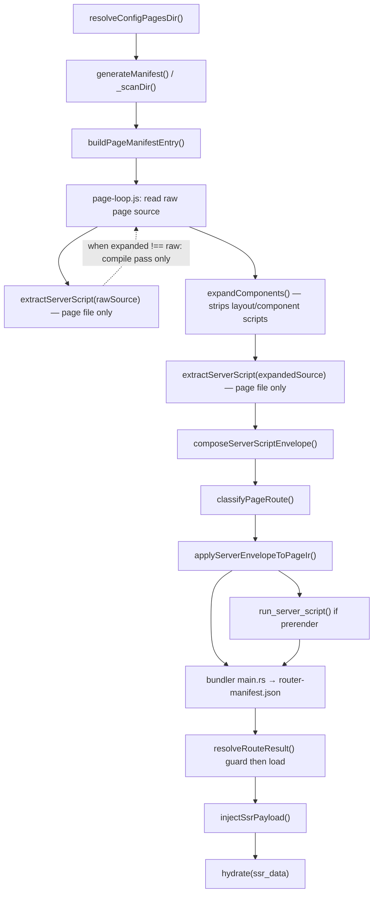

# Current Server Data Pipeline Audit

Status: Read-only factual audit (2026-05-22)
Scope: How Zenith server data fetching works today. No implementation guidance.
Out of scope: Cache/revalidation (documented separately; not covered here).

This document separates **confirmed current behavior** (verified against the repo) from a **non-binding future hypothesis** (Section 9 only).

---

## Summary

Zenith discovers **page routes** from `pagesDir`, extracts `<script server>` only from those page files, classifies render mode, emits route metadata, and executes guard/load at request time. Layout and component `.zen` files are compile-time structural units; their `<script>` blocks are stripped during template expansion and never become route server metadata. SSR data is a **single page-global object** (`ssr_data` / `data`) with no owner-scoped channel today.

---

## 1. Route discovery and ownership

### Confirmed: entry-file-based route discovery

| Stage | Owner file | Key function(s) |
|-------|-----------|-----------------|
| Resolve pages root | `packages/cli/src/config.js` | `resolveConfigPagesDir(projectRoot, config)` — prefers `projectRoot/pages`, else `projectRoot/src/pages` when present |
| Scan filesystem | `packages/cli/src/manifest.js` | `generateManifest(pagesDir, ext, compilerOpts)` → `_scanDir(dir, root, ext, compilerOpts, entries)` |
| File → URL path | `packages/cli/src/manifest.js` | `_fileToRoute(filePath, root, ext)` — `index`, `[param]`, `[...slug]`, `[[...slug]]` conventions |
| Build manifest entry | `packages/cli/src/manifest.js` | `buildPageManifestEntry({ fullPath, root, routePath, compilerOpts })` |
| Page vs resource | `packages/cli/src/manifest.js` + `packages/cli/src/resource-route-module.js` | Pages: `*.zen` → `route_kind: 'page'`. Resources: `isResourceRouteFile()` → `route_kind: 'resource'` |
| Param names on entry | `packages/cli/src/manifest.js` | `extractRouteParams(routePath)`, `_validateParams()` |
| Param values at request | `packages/cli/src/server/resolve-request-route.js` | `matchRoute()`, `resolveRequestRoute()` |
| Render mode on entry | `packages/cli/src/route-classification.js` | `classifyPageRoute({ file, serverScript })` → `renderMode: serverScript && !prerender ? 'server' : 'prerender'` |
| Apply to Page IR | `packages/cli/src/build/page-loop-state.js` | `applyServerEnvelopeToPageIr({ pageIr, composedServer, entry, srcDir, sourceFile })` |
| Emit router manifest | `packages/bundler/src/main.rs` | Writes `assets/router-manifest.json` (`has_load`, `ssr_data`, `server_script_path`, etc.) |
| Final build manifest | `packages/cli/src/build-output-manifest.js` | `writeBuildOutputManifest()` |
| Package server routes | `packages/cli/src/server-output.js` | `writeServerOutput()` — filters `route.server_script && route.prerender !== true` |

### Confirmed: layouts/components are not route owners

- Component registry: `packages/cli/src/resolve-components.js` — `buildComponentRegistry(srcDir)` scans `components/`, `layouts/`, `globals/` for PascalCase `*.zen` files.
- Registry files are **not** scanned by `generateManifest()` / `_scanDir()` as routes.
- Server data follows the **route manifest path**; it does not start from global component filesystem scanning.

### Confirmed: architectural gap for future scoped data

- **Today:** route discovery is **entry-file based** (one manifest entry per page `.zen` file).
- **Future scoped data** (if added) would need **dependency-graph based** discovery: page → used layouts/components → server exports on those owners only. This sentence describes a gap; it is not a spec.

---

## 2. Server script extraction and envelope composition

### Confirmed: extraction owner

**File:** `packages/cli/src/build/server-script.js` — `extractServerScript(source, sourceFile, compilerOpts)`

**Helpers:**
- `packages/cli/src/route-handler-export-analysis.js` — `readRouteHandlerExport(source, name)` for `guard` | `load` | `action`
- `packages/cli/src/static-export-paths.js` — `extractStaticExportPaths(serverSource, sourceFile)`

**Call sites (page files only):**
- `packages/cli/src/build/page-loop.js` — `buildPageEnvelopes()` calls `extractServerScript(rawSource, sourceFile, …)` and `extractServerScript(expandedSource, sourceFile, …)`
- `packages/cli/src/manifest.js` — `buildPageManifestEntry()` calls `extractServerScript(rawSource, fullPath, …)`

### Confirmed: parsing rules (`extractServerScript`)

- Regex `/<script\b([^>]*)>([\s\S]*?)<\/script>/gi`; `\bserver\b` in attributes marks a server block.
- Reserved exports in **non-server** `<script>` throw (`reservedServerExportRe` in `server-script.js` L15–16).
- Exactly **one** `<script server>` per file; block is **removed** from returned `source`.
- **Recognized exports (inline, regex at build time):** `guard`, `load`, `action`, `data`, `prerender`, legacy `ssr_data`, `props`, `ssr`, `exportPaths`.
- **Mutual exclusion at extract time:** `data` + `load`; new + legacy; duplicate guard/load/action exports; load/guard/action arity must be 1 when detectable.
- **`lang="ts"`:** required unless `compilerOpts.typescriptDefault === true` (`server-script.js` L53–66).
- **Metadata retained:** `serverScript.source_path = sourceFile` (the page path passed in). No owner kind, no layout/component path, no source map positions beyond file path.
- **Assumption:** `sourceFile` is always a page route file under `pagesDir`.

### Confirmed: adjacent modules

**File:** `packages/cli/src/server-script-composition.js`

| Function | Role |
|----------|------|
| `adjacentModuleCandidates(sourceFile, kind)` | `{stem}.guard.ts/js`, `{stem}.load.ts/js`, `{stem}.action.ts/js`; if stem is `index`, also `page.{kind}.ts/js` |
| `resolveAdjacentModule(sourceFile, kind)` | Resolves single existing adjacent file |
| `resolveAdjacentServerModules(sourceFile)` | Returns `{ guardPath, loadPath, actionPath }` |
| `composeServerScriptEnvelope({ sourceFile, inlineServerScript, adjacentGuardPath, adjacentLoadPath, adjacentActionPath })` | Merges inline body + re-exports from adjacent files into one virtual module string |

**Composition rules (`composeServerScriptEnvelope`):**
- Inline and adjacent exports for the same handler (`guard`/`load`/`action`) cannot both exist.
- Adjacent `load` cannot combine with inline `data` or legacy exports.
- **Single composed `serverScript` per page route** — no multi-owner envelope today.

### Confirmed: inline vs runtime validation split

| Phase | Owner | Function |
|-------|-------|----------|
| Build (source text) | `packages/cli/src/build/server-script.js` | `extractServerScript` — regex, arity, duplication |
| Build (composition) | `packages/cli/src/server-script-composition.js` | `composeServerScriptEnvelope` |
| Request / prerender (executed module) | `packages/cli/src/server-contract/export-validation.js` | `validateServerExports({ exports, filePath, routeKind })` |
| Request pipeline | `packages/cli/src/server-contract/resolve.js` | `resolveRouteResult({ exports, ctx, filePath, guardOnly, routeKind })` |

**Allowed export keys (runtime):** `packages/cli/src/server-contract/constants.js` — `ALLOWED_KEYS` for pages; `RESOURCE_ALLOWED_KEYS` for resources.

### Confirmed: Page IR attachment

**File:** `packages/cli/src/build/page-loop-state.js` — `applyServerEnvelopeToPageIr()`

Sets on Page IR: `server_script`, `prerender`, `has_guard`, `has_load`, `has_action`, `guard_module_ref`, `load_module_ref`, `action_module_ref`.

Re-runs `classifyPageRoute()` — same classification logic as manifest-time `buildPageManifestEntry()`.

---

## 3. Layout/component expansion and stripping behavior

### Confirmed: expansion owners

| File | Function | Role |
|------|----------|------|
| `packages/cli/src/resolve-components.js` | `expandComponents(source, registry, sourceFile)` | Entry: inline component tags into page source |
| `packages/cli/src/resolve-components.js` | `expandSource()` / `expandTag()` | Recursive tag replacement |
| `packages/cli/src/resolve-components.js` | `extractTemplate(zenSource)` | Template-only markup |
| `packages/cli/src/resolve-components.js` | `stripBlock(source, tag)` | Removes `<script>` and `<style>` blocks |
| `packages/cli/src/resolve-components.js` | `isDocumentMode(template)` | True when template contains `<!doctype` or `<html` |
| `packages/cli/src/component-occurrences.js` | `collectExpandedComponentOccurrences(source, registry, sourceFile)` | Walks usage graph; records `{ name, attrs, ownerPath, componentPath }` |
| `packages/cli/src/component-occurrences.js` | `materializeFragments()` | Document Mode slot splitting |
| `packages/cli/src/build/page-component-loop.js` | `runPageComponentLoop()` / `mergeComponentIr()` | Compiles component IR; `documentMode` flag for CSS-only imports |

### Confirmed: script stripping during expansion

Path in `expandTag()` (`resolve-components.js`):

```
readFileSync(compPath) → extractTemplate(compSource) → stripBlock(..., 'script') → stripBlock(..., 'style')
```

- **All `<script>` blocks are removed** — no distinction between `<script server>`, `<script setup>`, or `<script lang="ts">`.
- Layout/component `<script server>` content is **discarded**, not passed to `extractServerScript()`, not validated as route metadata.

### Confirmed: Document Mode (layouts)

- `isDocumentMode(template)` in `resolve-components.js` L162–164.
- Must contain exactly one `<slot />` (`expandTag` L283–291; `component-occurrences.js` L74–79).
- Slot children replace `<slot />`; same script stripping applies.

### Confirmed: parallel component compile path

- `page-component-loop.js` compiles component source via `stripStyleBlocks(componentSource)` — **styles removed, client scripts kept**.
- Component client scripts become `components_scripts` / `component_instances` in Page IR.
- This path does **not** produce route server metadata.

### Confirmed: metadata after expansion

- `component-occurrences.js` preserves per-tag `{ name, attrs, ownerPath, componentPath }`.
- `packages/cli/src/build/server-script.js` — `collectRecursiveComponentUsageAttrs()` walks component attrs recursively; **attrs only, not server exports**.
- Rust compiler (`packages/compiler/zenith_compiler/src/compiler.rs`) emits `server_script: None`, `ssr_data: None` on IR — server boundary is CLI-owned, not compiler-owned.
- Compiler does **not** classify files as page vs layout vs component; only `is_global` hoisted script vs component script hoisting (`script_extract.rs`).

### Confirmed: props path (not SSR data)

- Compiler: `component_instances` with props arrays (`contracts/PROPS_CONTRACT.md`).
- CLI: `packages/cli/src/build/scoped-identifier-rewrite.js` — `renderPropsLiteralFromAttrs()`; `merge-component-ir.js` — `mergeComponentIr()`.
- Bundler: `packages/bundler/src/bundler_emit_assets.rs`.
- Runtime: `packages/runtime/src/payload.js` — `_resolveComponentProps()`. Props are frozen at factory injection; not SSR data owners.

---

## 4. SSR data injection and hydration path

### Confirmed: bundler emits page-global data helpers

| File | Function / symbol | Behavior |
|------|-------------------|----------|
| `packages/bundler/src/page_runtime.rs` | `render_runtime_data_helpers(ssr_json)` | Emits `__zss`, `__zrd()`, `let __zenith_ssr_data`, `let data`, `let ssr_data`, `__zrr()` |
| `packages/bundler/src/bundler_page_entry.rs` | page entry generation | Calls `render_runtime_data_helpers`; passes `ssr_data: __zenith_ssr_data` into `hydrate()` |
| `packages/bundler/src/main.rs` | build loop | `run_server_script()` when `prerender`; writes `router-manifest.json` fields |
| `packages/bundler/src/bundler_server_script.rs` | `run_server_script(server_script, params)` | Build-time VM eval of page `server_script` for prerender; runs `load` or static `data`/`ssr_data`/`props`/`ssr` — **does not run `guard`** |

### Confirmed: request-time SSR HTML injection

| File | Function | Behavior |
|------|----------|----------|
| `packages/cli/src/preview/payload.js` | `injectSsrPayload(html, payload)` | Inserts `<script id="zenith-ssr-data">window.__zenith_ssr_data = …</script>` |
| `packages/cli/src/server-runtime/route-render.js` | `renderRouteRequest()` / pipeline | Uses `injectSsrPayload` after guard/load resolve |
| `packages/cli/src/dev-server/request-handler.js` | request handler | Calls server route execution; injects payload when `prerender !== true` |
| `packages/cli/src/preview/request-handler.js` | preview handler | Same pattern |

**Prerender HTML write** (`packages/bundler/src/main.rs` HTML emission): does **not** inject `#zenith-ssr-data`; data is baked into `__zss` in the JS bundle instead.

### Confirmed: guard/load execution order

**File:** `packages/cli/src/server-contract/resolve.js` — `resolveRouteResult()`

Order for page routes:
1. `validateServerExports()`
2. `guard(ctx)` if exported — `allow` | `redirect` | `deny` only
3. `action(ctx)` on POST if exported
4. `load(ctx)` if exported — or legacy `data` / `ssr_data` / `props` / `ssr` exports

**Result helpers:** `packages/cli/src/server-contract/result-helpers.js` — `allow()`, `redirect()`, `deny()`, `data()`.

Request-time execution does **not** reference layouts or components — only the composed page route module.

### Confirmed: hydration reads single page payload

| File | Role |
|------|------|
| `packages/runtime/src/payload.js` | `_validatePayload()` — extracts `payload.ssr_data` → `ssrData` |
| `packages/runtime/src/hydrate.js` | Passes `ssrData` into binding context |
| `packages/runtime/src/expressions.js` | `_resolveStrictBase()` — `data` and `ssr` roots resolve to page `ssrData` |
| `packages/router/template-document.js` | `extractSsrData()` — parses `#zenith-ssr-data` from fetched HTML (soft nav) |
| `packages/router/template-core.js` | Sets `scope.__zenith_ssr_data` before page chunk mount |

**Confirmed:** No owner-scoped SSR namespace. One object per page route.

### Confirmed: static target rejection

`packages/cli/src/adapters/adapter-static.js` (and `adapter-static-export.js`, `adapter-vercel-static.js`, `adapter-netlify-static.js`) — `validateRoutes()` rejects entries with `render_mode === 'server'`.

---

## 5. Contract enforcement matrix

| Contract | Enforced by | Owner file / symbol |
|----------|-------------|---------------------|
| Markup expression allowed roots (`props`, `data`, `params`, `ssr`, `ssr_data`) | **Compiler** (hard error) | `packages/compiler/zenith_compiler/src/compiler_expression_validate.rs` — `SAFE_ROOTS`, `validate_unbound_expressions()` |
| Unbound markup identifiers | **Compiler** | `compiler_expression_validate.rs`; invoked from `compiler.rs` |
| Event handler shape, foreign syntax | **Compiler** | `parser_elements.rs`, `foreign_syntax.rs`, `foreign_syntax_scan.rs`, `event_contract.rs` |
| Client script forbidden tokens | **Compiler** | `script_contract.rs` — `assert_no_forbidden_tokens()` |
| Server exports only in `<script server>` | **CLI** (build) | `server-script.js` — `reservedServerExportRe` on client scripts |
| `data` vs `load` mutual exclusion | **CLI** (build + runtime) | `server-script.js`; `export-validation.js` |
| `guard` before `load` at request time | **CLI** | `server-contract/resolve.js` — `resolveRouteResult()` |
| JSON-serializable payload | **CLI** | `server-contract/json-serializable.js` — `assertJsonSerializable()` |
| Static adapter rejects server routes | **CLI** | `adapters/adapter-static.js` et al. |
| Single page-level `ssr_data` | **Bundler + runtime** | `page_runtime.rs`; `expressions.js` |
| Props frozen at factory injection | **Runtime** | `payload.js`; normative in `contracts/PROPS_CONTRACT.md` |
| Page route server API surface | **Docs + CLI runtime** | `contracts/SERVER_API_CONTRACT.md`; enforced at runtime via `validateServerExports()` |
| Components are structural macros | **Docs + CLI expansion** | `contracts/ZENITH_COMPONENT_MODEL.md`; `resolve-components.js` |
| Document Mode layout rules | **Docs + CLI** | `contracts/DOCUMENT_CONTRACT.md`; slot count in `expandTag()` / `materializeFragments()` |
| Page vs layout vs component file kind | **Convention only** | Not in Rust compiler; CLI path-based registry + pagesDir scan |

---

## 6. Current limitation proof

### Confirmed: why page `<script server>` works

1. Page file under `pagesDir` is scanned → `buildPageManifestEntry()` (`manifest.js`).
2. `extractServerScript(rawSource, fullPath)` extracts inline server block from **page file**.
3. `composeServerScriptEnvelope()` merges adjacent guard/load/action modules.
4. `applyServerEnvelopeToPageIr()` sets `has_load`, `server_script` on Page IR (`page-loop-state.js`).
5. Bundler writes `router-manifest.json` with `has_load: true` when applicable (`main.rs`).
6. Dev/preview/node server runs `resolveRouteResult()` → `injectSsrPayload()` → `window.__zenith_ssr_data`.
7. Page bundle: `let data = __zenith_ssr_data` (`page_runtime.rs`); hydration reads `ssrData` (`payload.js`).

### Confirmed: why layout/component server scripts do not work as route data

| Step | What happens to layout `<script server>` |
|------|------------------------------------------|
| Page imports layout | `expandComponents()` inlines layout template |
| Script handling | `extractTemplate()` → `stripBlock(..., 'script')` removes **all** scripts including `<script server>` |
| Route extraction | `extractServerScript()` runs on **page file only** — layout server block already discarded |
| Manifest | `buildPageManifestEntry()` sees no page server script → `has_load: false` |
| Router manifest | `assets/router-manifest.json`: `"has_load": false`, `"ssr_data": null` |
| Request time | No layout module in composed route envelope → route `load` never executed |
| Metadata outcome | Layout/component server exports do **not** become route manifest entries, Page IR server fields, or composed server envelope input — regardless of what client-side compilation paths may emit separately |

Component `<script server>` follows the same stripping path via `expandTag()` → `extractTemplate()`.

### Confirmed: `has_load: false` when only layout has `load`

**Causal chain (verified against pipeline owners):**

```
pages/index.zen          → no <script server>
                         → extractServerScript(page) → serverScript: null

layouts/DefaultLayout.zen → <script server> with export const load
                         → expandComponents() strips script (extractTemplate/stripBlock)
                         → never passed to extractServerScript()
                         → not in composeServerScriptEnvelope()

buildPageManifestEntry() → composed.serverScript null or page-only
classifyPageRoute()      → hasLoad: false
applyServerEnvelopeToPageIr() → pageIr.has_load: false
bundler main.rs          → router-manifest.json has_load: false
```

### Confirmed: why component prop consumption works

- Page `load()` (or `data`) produces page-global SSR object.
- Page markup passes values via props: e.g. `navigationContent={data.site.navigation}`.
- Layout reads `props.navigationContent`; passes `content={navigationContent}` to child.
- Navigation reads `(props || {}).content` — static prop at factory time (`PROPS_CONTRACT.md`).
- Props do not require route server metadata on the component file itself.

---

## 7. Gaps blocking scoped layout/component `data()`

1. **No dependency-graph server export discovery** — `generateManifest()` scans pages only; no pass collects server exports from used layouts/components.
2. **Expansion destroys layout/component scripts** — `extractTemplate()` / `stripBlock()` in `resolve-components.js` with no extraction hook for server blocks.
3. **Single server envelope slot** — `composeServerScriptEnvelope()` and Page IR `server_script` assume one route owner (`server-script-composition.js`, `page-loop-state.js`).
4. **Classification coupling** — `classifyPageRoute()` treats any route `serverScript` as server render (`route-classification.js` L16); scoped owners need explicit rules not present today.
5. **Server packaging blind spot** — `server-output.js` packages route-level `server_script` only; no scoped module list.
6. **No owner-scoped SSR namespace** — `page_runtime.rs` and `expressions.js` expose one page-global `ssrData`.
7. **Occurrence metadata incomplete for server** — `component-occurrences.js` records tag attrs, not server export ownership.
8. **Compiler IR has no server script** — `compiler.rs` always `server_script: None`; server boundary is CLI-only.

### Layers that must change for future scoped data (factual dependency list, not implementation plan)

| Layer | Current owner | Why it must change |
|-------|---------------|-------------------|
| CLI manifest | `manifest.js` | Must record scoped server data owners per route entry |
| Component graph | `component-occurrences.js`, `resolve-components.js` | Must discover used layout/component owners from page dependency graph |
| Page IR | `page-loop-state.js` | Must carry scoped server module refs beyond single `server_script` |
| Server output | `server-output.js` | Must package scoped modules for request-time execution |
| Bundler SSR payload | `page_runtime.rs`, `bundler_page_entry.rs`, `main.rs` | Must emit scoped hydration keys, not only page-global `__zss` |
| Runtime hydration | `payload.js`, `expressions.js`, `hydrate.js` | Must resolve owner-scoped data expressions if introduced |

Patching `resolve-components.js` alone is insufficient; manifest, Page IR, server-output, bundler, and runtime remain blind without coordinated changes.

---

## 8. Risks for future integration

1. **Wrong-layer fix** — Adding extraction only in `expandTag()` without manifest, IR, server-output, bundler, and runtime updates leaves `has_load: false` and empty SSR payloads.
2. **Global component scan** — Scanning all `*.zen` for server exports is expensive, breaks ownership semantics, and contradicts compile-time-first component model (`ZENITH_COMPONENT_MODEL.md`).
3. **Accidental server classification** — Scoped layout `data()` could mark pages `render_mode: 'server'` if merged naively into `classifyPageRoute()` input.
4. **Manifest / IR divergence** — Updating only `buildPageManifestEntry()` or only `applyServerEnvelopeToPageIr()` produces inconsistent `has_load` and bundler input.
5. **Per-instance vs singleton** — Same component used multiple times on one page (`page-component-loop.js` `useIsolatedInstance`) has no data ownership model today.
6. **Prerender interaction** — `classifyPageRoute()` forbids `prerender` with guard/load/action (`route-classification.js` L7–11); scoped dynamic data on prerender routes is undefined today.
7. **Misleading local authoring** — Layout/component `<script server>` can exist in source but never registers on the route; developers may assume fetching works because the block parses locally (`extractServerScript()` in `page-loop.js` never receives stripped layout/component server blocks).

---

## 9. Non-binding future hypothesis appendix

> **This section is explicitly non-binding.** It is not a spec, not an approved API, and not implementation guidance. It records a working hypothesis for a future design review only.

Future scoped layout/component fetching likely requires **dependency-graph based** discovery:

```
page route discovered (manifest.js)
  → page source parsed
  → layout/component graph resolved (component-occurrences.js / expandComponents)
  → server data() exports discovered from used owners only
  → route manifest + Page IR record scoped server data modules
  → SSR execution runs route guard/load + scoped data() owners
  → bundler emits scoped hydration payload
  → runtime resolves owner-scoped keys at hydration
```

Hypothetical metadata shape (not in codebase):

```ts
// NON-BINDING — illustration only
type RouteScopedServerDataOwner = {
  ownerKind: 'layout' | 'component'
  ownerPath: string
  exportName: 'data'
  modulePath: string
  instanceStrategy: 'singleton' | 'per-instance'
}
```

Hypothetical manifest extension (not in codebase):

```json
{
  "path": "/dashboard",
  "file": "src/pages/dashboard.zen",
  "server_script": "...",
  "scoped_server_data": [
    { "ownerKind": "layout", "ownerPath": "src/layouts/AppLayout.zen", "exportName": "data" },
    { "ownerKind": "component", "ownerPath": "src/components/RepoStats.zen", "exportName": "data" }
  ]
}
```

**Open question for a future audit slice:** Does `collectExpandedComponentOccurrences()` plus existing Page IR merge provide sufficient graph metadata to attach owners, or is a new pre-expansion graph-collection pass required?

---

## Reference: end-to-end pipeline (confirmed)



**Note:** `buildPageEnvelopes()` in `packages/cli/src/build/page-loop.js` calls `extractServerScript()` on **both** `rawSource` (L118) and `expandedSource` (L142). Only the expanded extraction result feeds `composeServerScriptEnvelope()`. Layout/component scripts are stripped during `expandComponents()` before expanded extraction runs.

---

## Normative contracts referenced (unchanged by this audit)

- `contracts/SERVER_API_CONTRACT.md`
- `contracts/SERVER_CLIENT_CONTRACT.md`
- `contracts/ZENITH_COMPONENT_MODEL.md`
- `contracts/PROPS_CONTRACT.md`
- `contracts/DOCUMENT_CONTRACT.md`
