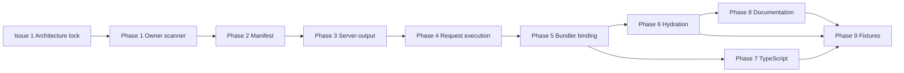

# Component Server Values v1

**Public capability:** Component Server Values v1  
**Alternate public name:** Component Server Adaptability  
**Internal mechanism:** Scoped Server Data (payload, keys, scanner, hydration plumbing)

> **Core principle:** Pages anchor emitted documents. Routes control requests. Components compose structure and own local server values.
>
> This document uses **Component Server Values** for product direction and DX, and **scoped server data** for implementation internals. They are the same milestone — different lenses.
>
> Do **not** frame this as "Server Components v1," React Server Components, Svelte route loaders, or route-directory-owned document/data architecture.

Status: Design approved — architecture lock in progress — implementation gated on Issue 1 (2026-05-22)  
Scope: Component server values in layouts and components — discovery, diagnostics, route metadata, execution, serialization, hydration, TypeScript support, migration, documentation, and regression coverage.  
Out of scope for v1 implementation: cache/revalidation behavior, scoped redirect/deny/action, page-level server variables, build-time scoped prerender, client-side scoped refetch, global component scans, and React Server Components-style server/client component classes.  
Out of scope for this document edit: package/source implementation changes.

Prerequisite audit: [`docs/audits/CURRENT_SERVER_DATA_PIPELINE.md`](../audits/CURRENT_SERVER_DATA_PIPELINE.md) (accepted).

**Do not start implementation (Issue 2+) until Issue 1 (architecture lock) is complete.** See Section 19.

---

## Scope lock — no ambiguity rule

This plan is the v1 contract. Implementation must not reinterpret, expand, or partially bypass it.

### In scope for v1

- Layout/component server values in used `.zen` owners only.
- Primary DX: top-level `const` server values in `<script server lang="ts">`.
- Advanced DX: scoped `export const data = async (ctx[, props]) => ({ ... })`.
- Dependency-graph discovery from page entries to used layouts/components.
- Owner-local serialization and hydration slices.
- Request-time execution for server targets.
- CLI owner-scanner diagnostics for invalid owner APIs and invalid Level 1 bindings.
- Route classification using `has_scoped_server_data` while keeping `has_load` route-only.
- TypeScript-first authoring and phased owner-local type generation.
- Meticulous documentation and migration guidance before v1 closes.

### Explicitly out of scope for v1

- Component or layout `load()`.
- Component or layout `guard()` / `action()`.
- Component or layout `redirect()` / `deny()`.
- Page-level server variables.
- Cache/revalidation behavior.
- Build-time scoped prerender.
- Client-side scoped refetch.
- Server values re-executing on client re-render, signal update, effect execution, DOM update, or remount.
- Global filesystem scanning for all components with server blocks.
- React Server Components-style server/client component class split.
- Streaming, suspense, partial server islands, or deferred island endpoints.
- Mutating Level 1 bindings (`let`, reassignment, increment/decrement) in serialized server values.
- Silent fallback when scoped owner execution fails.

### No hidden expansion rule

If a needed behavior is not listed as in scope, it is out of scope for v1. Add a follow-up issue instead of implementing it opportunistically.

Any PR that changes server-output, bundler payloads, runtime hydration, or docs before the metadata/diagnostic phases are complete must explicitly reference the issue dependency that allows it.

---

## 0. Architecture (locked)

### Core principle

**Pages anchor emitted documents. Routes control requests. Components compose structure and own local server values.**

Three roles — do not collapse them:

| Role | Owner | Responsibility |
|------|-------|----------------|
| **Page route** | `src/pages/*.zen` | Output anchor + route entry |
| **Router** | Page-entry server contract | Request control (`guard`, `load`, `action`) |
| **Component tree** | Layouts/components | Document structure + local server values |

Two separate server systems — do not merge them:

| System | Owner | Purpose |
|--------|-------|---------|
| **Router server contract** | Page route entries | Control access, redirects, params, actions, page-level outcomes |
| **Component server values contract** | Layouts/components | Fetch/render local server values where they are used |

---

### 0.1 Page-anchored document output

Zenith is component-first, but **emitted HTML/request output is page-anchored**.

- Files under `src/pages/` are **route entries and output anchors**.
- `src/pages/index.zen` owns the emitted `/` document.
- `src/pages/about.zen` owns the emitted `/about` document.
- A page may compose a **document-mode** component/layout that contains `<html>`, `<head>`, and `<body>`.
- That component supplies document **structure**, but the **page route owns the emitted document artifact**.
- Document-mode components do **not** emit output independently unless reached through a page route.
- A page render must resolve to **exactly one document root**.
- Nested or competing document roots → **build diagnostic**.

This prevents drift into route-directory-owned document architecture or independent component emission.

---

### 0.2 Components compose structure

Components and layouts are reusable structural shells — not limiting "wrappers":

- document shells
- body shells
- head fragments
- layout shells
- page section components
- leaf components

These are **component-authored structure** that the page composes into an emitted document. The page anchors output; the component tree supplies shape.

---

### 0.3 Routes control requests

Route APIs remain **router-owned and page-entry anchored**:

- `guard`
- `load`
- `action`
- `redirect`
- `deny`

Routes decide request access, redirects, actions, and page-level outcomes.

**This does not mean routes own all server data.** Page-level `load(ctx)` is one payload channel. Layouts/components own **local** server values separately.

Route control may live in adjacent files but always ties to the page entry:

```
src/pages/dashboard.zen
src/pages/dashboard.load.ts
src/pages/dashboard.guard.ts
src/pages/dashboard.action.ts
```

---

### 0.4 Components own local server values

Layouts/components may declare server-only values where those values are used.

**Primary DX:**

```zen
<script server lang="ts">
const navigation = await getNavigation()
</script>
<Navigation content={navigation} />
```

**Component with props:**

```zen
<script server lang="ts">
const stats = await getRepoStats(props.repoId)
</script>
<Card>
  <p>{stats.stars}</p>
</Card>
```

**Advanced DX (escape hatch, not component `load()`):**

```zen
<script server lang="ts">
export const data = async (ctx, props) => ({
  stats: await getRepoStats(ctx, props.repoId)
})
</script>
```

This is scoped `data()` — not route `load()`. Do not call these "component data loaders."

### File capability matrix (v1)

| File | `guard` | route `load` | route `action` | local server values | emitted document artifact |
|------|---------|--------------|----------------|---------------------|---------------------------|
| `src/pages/*.zen` | yes | yes | yes | no in v1 | yes |
| `src/layouts/*.zen` | no | no | no | yes | no |
| `src/components/*.zen` | no | no | no | yes | no |

**Important:** `src/pages/*.zen` does not get page-level server variables in v1. Pages keep the existing route server contract (`guard`, `load`, `action`, legacy/alternate page `data`) so this milestone does not mix route payload semantics with component-local server values.

### Capability boundary (v1)

| Capability | Route/Page entry | Layout/Component |
|------------|------------------|------------------|
| Fetch server values | yes, through route `load` / existing page server contract | yes, through local server values or scoped `data()` |
| Read props | yes | yes |
| Read `ctx` | yes | advanced only through scoped `data(ctx[, props])` |
| `redirect` | yes | **no** |
| `deny` | yes | **no** |
| `action` / POST mutation | yes | **no** |
| Route classification | yes | contributes only through `has_scoped_server_data` |
| Own emitted document artifact | yes (page entry) | no (structure only) |
| Declare document structure | yes | yes, only when page-anchored and single-root |

**Why no redirect/deny in components v1:** A nested component must not control the whole request. If `<ProductRecommendations />` redirects on an API failure, parent page behavior becomes hidden inside a child.

---

### 0.5 Server adaptability — not React Server Components

Do **not** frame this as "Server Components v1."

**Zenith's model (Component Server Adaptability):**

- Ordinary `.zen` components can adapt to server rendering by declaring server values.
- Server values execute at **controlled server boundaries** only.
- Server values serialize into **owner-local hydration slices**.
- Hydration consumes serialized values.
- Client re-renders, signals, effects, and DOM updates do **not** re-execute server values.

**What this is not:**

- Not component `load()` / "component data loaders"
- Not React Server Components
- Not Svelte load functions
- Not Vue async setup
- Not route-directory-owned document/data architecture

---

### 0.6 No render-loop fetching

Server values must **not** execute because of:

- client re-render
- signal update
- effect execution
- DOM update
- component remount on the client

Execution happens only at **controlled server boundaries**:

- request render (v1)
- future build/prerender render if supported (follow-up)
- future explicit cache/revalidation refresh boundary (follow-up)

**Hydration must not refetch by default.** Serialized values are consumed; they are not re-fetched on the client lifecycle.

---

### 0.7 Cache seam preserved (implementation out of v1)

Do **not** implement cache/revalidation in this milestone.

The design must preserve a future cache seam keyed by:

- owner key
- route id
- props used by the server value
- route params / context
- explicit future cache policy

Do **not** couple server value execution to client component lifecycle — future caching would be unsafe if execution were tied to re-renders or hydration remounts.

---

### 0.8 TypeScript-first, migration-safe

Zenith is gradually migrating from JS to TypeScript.

- `<script server lang="ts">` remains canonical.
- JS compatibility follows existing compiler options only.
- Do not force all diagnostics into the Rust compiler in v1 — audit confirms CLI/path ownership today.
- TS type generation can be phased **after** metadata/execution are stable (Issue 8).
- Keep existing page `load()` behavior working.
- Keep existing JS-compatible apps working where current config allows.

---

### 0.9 Documentation is a dedicated phase — not cleanup

Documentation must not lag implementation. If the framework model changes and docs lag, authors will keep trying layout `load()` and repeat the same confusion.

Documentation is **Issue 9** — its own tracked phase after behavior is stable, **not** bundled into the test/fixture issue.

See Section 19, Phase 8 (Documentation).

---

## 1. Goal

Enable layouts and components to declare **local server values** available in their templates during SSR and hydration, without breaking the page-anchored document model or the route-level security boundary (`guard` / `load` on pages only).

**Public story:** Ordinary Zenith components can declare server values where they are used. Pages anchor documents; routes control requests; components compose structure.

**Headline DX:** *Declare the server value where you need it, then use it.*

**Internal model:** Strict — every component server value owner resolves to `ownerPath → data function → scoped payload → hydration key`. **Authoring surface:** Simple by default; explicit scoped `data()` only when needed.

---

## 2. Confirmed blockers (from audit)

These are factual gaps today; integration must address all of them coherently.

| # | Blocker | Current owner | Consequence |
|---|---------|---------------|-------------|
| B1 | No dependency-graph server discovery | `manifest.js` scans pages only | Layout/component server blocks never register |
| B2 | Expansion strips scripts | `resolve-components.js` `extractTemplate()` / `stripBlock()` | Server blocks discarded before extraction |
| B3 | Single server envelope slot | `server-script-composition.js`, Page IR | One route `server_script`; no scoped owners |
| B4 | Classification coupling | `route-classification.js` | Any route `serverScript` → `render_mode: 'server'`; scoped rules absent |
| B5 | Server packaging blind spot | `server-output.js` | Only route-level modules packaged |
| B6 | Page-global SSR only | `page_runtime.rs`, `expressions.js`, `payload.js` | One `ssrData` / `data`; no owner keys |
| B7 | Occurrence metadata incomplete | `component-occurrences.js` | Tag attrs recorded; no scoped server ownership |
| B8 | Compiler IR has no server script | `compiler.rs` | Server boundary is CLI-only today |

**Confirmed non-behavior:** Layout/component server exports do **not** become route manifest entries, Page IR server fields, or composed server envelope input — regardless of separate client compilation paths.

**Confirmed extraction path:** `page-loop.js` calls `extractServerScript()` on **both** raw and expanded page source; only page-file extraction feeds the envelope. Layout/component blocks are stripped during expansion before expanded extraction.

---

## 3. DX decision

### 3.1 Two authoring levels

| Level | Syntax | Role |
|-------|--------|------|
| **Level 1 (primary, documented default)** | Top-level server variables in `<script server>` | Component local server values |
| **Level 2 (advanced escape hatch)** | `export const data = async (ctx) => ({ ... })` | Request context, auth, params, cookies |
| **Forbidden in layouts/components** | `export const load = async (ctx) => ...` | Route-only; not "component loaders" — CLI build / owner-scanner diagnostic (v1) |

### 3.2 Primary DX — server variables

```zen
<script server lang="ts">
import { getNavigation } from '@/lib/navigation'
const navigation = await getNavigation()
</script>
<Navigation content={navigation} />
```

Component with props:

```zen
<script server lang="ts">
import { getRepoStats } from '@/lib/repos'
const stats = await getRepoStats(props.repoId)
</script>
<Card>
  <p>{stats.stars}</p>
</Card>
```

**Properties:**
- No forced `ctx` parameter in simple cases
- No forced `return { ... }` wrapper
- Variables are directly usable in markup
- External fetch functions work via imports
- `ctx` remains available when the author passes it explicitly to helpers

### 3.3 Advanced DX — explicit `data()`

```zen
<script server lang="ts">
export const data = async (ctx) => {
  const viewer = await ctx.auth.viewer()
  return {
    viewer,
    navigation: await getNavigation({ orgId: viewer.orgId })
  }
}
</script>
<Navigation content={data.navigation} viewer={data.viewer} />
```

Use when framework context (params, request, cookies, auth) is required at the owner boundary.

### 3.4 Internal lowering (same contract)

| Author syntax | Internal representation |
|---------------|-------------------------|
| `const navigation = await getNavigation()` | Scoped data variable `navigation` |
| `const stats = await getStats(props.id)` | Scoped data variable with prop dependency |
| `export const data = async (ctx) => ({ ... })` | Explicit scoped data function |
| `export const load = ...` | **Diagnostic:** route-only API (CLI owner scanner v1) |

Compiler/CLI lowers Level 1 into the same normalized payload shape as Level 2. Users do not author the low-level envelope.

**Level 1 serialization rule (v1):** Only top-level server bindings referenced from that owner's template expressions or outbound prop expressions are serialized into the scoped payload. Intermediate bindings may exist in the lowered server module but are **not** included in the returned payload unless referenced by markup. If a referenced value is not JSON-serializable, SSR fails with a serialization error.

Example:

```zen
<script server lang="ts">
const raw = await getNavigation()
const navigation = normalizeNav(raw)
</script>
<Navigation content={navigation} />
```

Payload includes `{ navigation }` only — not `{ raw, navigation }`. This protects against accidental leakage of raw API responses or secrets.

**Level 1 binding restrictions (v1):**
- Top-level `const` bindings only. `let` is rejected until a mutation-safe lowering rule exists.
- Top-level `await` in initializers is supported (same as route server scripts today).

**Reserved scoped binding names (Level 1):** Server variables may not declare `data`, `props`, `params`, `ssr`, `ssr_data`, `ctx`, or other compiler/framework reserved roots. Violation is a CLI build / owner-scanner diagnostic (v1).

**Level 1 non-goals (v1):** No `let`, no reassignment, no mutation-derived serialized bindings, no exported functions as serialized values, no implicit serialization of all top-level bindings, and no client script access. If an author needs complex preparation, keep intermediate values server-local and expose one final referenced `const`.

### 3.5 Safety rule — no client leakage

Server variables are available to:
- That owner's template expressions
- Serialized SSR / hydration payloads for that owner

They are **not** available to client `<script>` / `<script setup>` unless explicitly passed through serialized markup/props/hydration.

```zen
<!-- OK -->
<script server lang="ts">const navigation = await getNavigation()</script>
<nav>{navigation.title}</nav>

<!-- ERROR (build-time diagnostic; compiler-owned later if owner metadata exists) -->
<script server lang="ts">const secret = await getSecret()</script>
<script setup>console.log(secret)</script>
```

### 3.6 Route layer unchanged

Pages retain the control API:

```zen
<script server lang="ts">
export const guard = async (ctx) => { ... }
export const load = async (ctx) => ctx.data({ dashboard: await getDashboard(ctx) })
</script>
```

| Layer | Simple data DX | Control API |
|-------|----------------|-------------|
| Page route | route `load(ctx)` / legacy page `data` only — no page-level server variables in v1 | `guard`, `redirect`, `deny`, `action` |
| Layout | server vars or scoped `data(ctx)` | none in v1 (no redirect/deny/action) |
| Component | server vars or scoped `data(ctx, props)` | none in v1 (no redirect/deny/action) |

---

## 4. API decisions

### 4.1 Route `load()` remains route-only — not component loaders

- `load(ctx)` continues to mean: route security/control boundary + page-global payload. **Router-owned.**
- Layout/component `load()` is a **misuse** — this is not "component load()". CLI build / owner-scanner diagnostic with teaching message (Section 14). May become compiler-owned later if the compiler receives page/layout/component owner metadata.
- Layouts/components use **server variables** or advanced scoped **`data()`** only — never route control APIs.

### 4.2 Page-level `data()` vs `load()`

**Decision:** Keep both on pages as today; document distinct roles:

| Export | Role | Returns |
|--------|------|---------|
| `load(ctx)` | **Primary route data API** — security-adjacent, params/request aware, canonical in docs | `ctx.data(...)`, `redirect`, `deny` |
| `data(...)` | **Legacy/alternate page payload** — still supported where shipped; mutually exclusive with `load` at extract time | Plain payload object (no ctx wrapper) |

Scoped owners **do not** use page `data()` semantics. Their Level 1 variables and Level 2 `data(ctx[, props])` are a **separate scoped contract**: plain serializable records only; no `ctx.data()`, `redirect`, or `deny` in v1.

### 4.3 Scoped `data()` restrictions (v1)

- Return type: plain JSON-serializable object (same constraints as route payload values).
- **No** `redirect()`, **no** `deny()`, **no** route result helpers.
- Throwing propagates as server/render failure for that owner (runtime error).

---

## 5. Internal normalized contract (scoped server data)

Every scoped owner resolves to:

```ts
type ScopedServerDataOwner = {
  ownerKind: 'layout' | 'component'
  ownerPath: string           // absolute-resolved .zen path
  ownerKey: string            // stable manifest key (path-normalized)
  syntax: 'variables' | 'explicit-data'
  serializedVariableNames?: string[]  // Level 1 only: markup-referenced subset
  exportName: 'data'          // Level 2; synthesized name for Level 1
  modulePath: string          // emitted server module for request execution
  instanceStrategy: 'singleton' | 'per-instance'
  propDependencies?: string[]   // component: prop names read in server block
  occurrenceIds?: string[]      // per-instance: stable occurrence ids from graph
}
```

### v1 invariants

- `ownerKey` must be stable across dev/build for the same source graph.
- `ownerKey` must be path-normalized and must not include machine-specific absolute paths in public manifests.
- `serializedVariableNames` is the only Level 1 payload allowlist.
- `has_load` is route-only and must never be inferred from scoped owners.
- `has_scoped_server_data` is the only v1 route-level signal for component server values.
- Scoped owner execution failure is fatal for the request in v1; no silent omit and no partial hydration fallback.
- Scoped payload values must be JSON-serializable.

**Execution order (design):**

```
route guard (page)
  → route load (page) — page-global payload
  → layout scoped data owners (outer → inner, tree order)
  → component scoped data owners (DOM tree order, respecting per-instance keys)
  → merge into scoped SSR payload map
  → render templates with owner-local bindings
```

Route `guard`/`load` failures short-circuit before scoped execution. Scoped owner failure fails the render for that request (no partial silent omit in v1).

---

## 6. Layout: discovery, execution, serialization, hydration

### 6.1 Discovery

1. Page route discovered (`manifest.js` / `page-loop.js`).
2. **Pre-expansion graph pass** (new): from page source, resolve used layout chain (not global scan).
3. For each layout owner in the chain, read layout `.zen` source **before** `stripBlock()`.
4. Detect:
   - Level 1: top-level `const` bindings with top-level `await` initializer in `<script server>` (`let` rejected in v1)
   - Level 2: `export const data = async (ctx) => ...`
5. Reject `export const load/guard/action` with owner-specific CLI diagnostics.
6. Compute Level 1 **serialization set**: bindings referenced from template expressions or outbound prop expressions only (Section 3.4).
7. Reject reserved Level 1 binding names (`data`, `props`, `params`, `ssr`, `ssr_data`, `ctx`, etc.).
8. Record owners on route manifest entry + Page IR extension (`scoped_server_data[]`).

**Do not scan unused layouts/components.** Only owners reachable from the page dependency graph are eligible.

**Singleton:** One layout file → one scoped owner per route (layout is not instanced).

### 6.2 Execution

- Request-time: import layout server module from `server-output` bundle.
- Level 1 lowered form: `export async function data(ctx) { ... return { /* serialization set only */ } }`
- Invoke `data(routeCtx)` once per layout owner.
- Merge result under hydration key `layout:{ownerKey}`.

### 6.3 Serialization

Payload fragment:

```json
{
  "scoped": {
    "layout:src/layouts/DefaultLayout.zen": {
      "navigation": { "...": "..." }
    }
  }
}
```

Keys are stable, path-normalized, not user-facing in markup.

### 6.4 Hydration / template binding

- SSR: layout template expressions referencing `navigation` resolve from owner-local scoped binding during server render.
- Client: layout factory receives hydrated scoped slice for that owner key (same as SSR values).
- Layout does **not** read page-global `data` unless passed as props from page (existing prop contract unchanged).

---

## 7. Component: discovery, execution, serialization, hydration

### 7.1 Discovery

Same graph pass as layouts, driven by `collectExpandedComponentOccurrences()` extended with:
- `ownerPath` for each component tag
- `occurrenceId` (stable per tag site in expanded tree)
- `staticProps` / prop expression refs for server dependency analysis

Detect Level 1 / Level 2 server blocks in component source (pre-strip).

### 7.2 Explicit `data(ctx, props)` (Level 2)

- Signature: `(ctx, props) => Promise<Record<string, unknown>>` or sync equivalent.
- `props` is the **resolved static props** available at compile time where possible; dynamic prop expressions mark prop dependencies for runtime re-resolution.

### 7.3 Level 1 prop dependencies

- Static analysis: if server variable initializer references `props.foo`, record `propDependencies: ['foo']`.
- At execution: pass resolved prop values into lowered `data(ctx, props)`.

### 7.4 Repeated instances

**Decision:** Align with existing `useIsolatedInstance` in `page-component-loop.js`:

| Condition | `instanceStrategy` | Hydration key |
|-----------|-------------------|---------------|
| Component appears once on page | `singleton` | `component:{ownerKey}` |
| Component appears N > 1 times | `per-instance` | `component:{ownerKey}:{occurrenceId}` |

Each occurrence with distinct static props may produce distinct payloads even for the same component file.

**occurrenceId source:** Extend the occurrence collector with a deterministic id based on the page route id, owner path, tag path in the expanded tree, and ordinal among the same owner. The id must be stable across dev/build for unchanged source and must not depend on absolute machine paths.

Execution: one `data()` call per `(ownerKey, occurrenceId)` pair when `per-instance`.

### 7.5 Hydration

- Component template binds server variables from owner-scoped slice, not page-global `data`.
- Parent passing `{stats.stars}` as prop remains valid; scoped data fills **internal** template refs only unless author explicitly forwards via props.

---

## 8. `render_mode` and route classification

### 8.1 Decision: scoped data forces server render (v1)

Any route whose dependency graph includes a scoped server data owner (layout or component) is treated as **dynamic server data** in v1. Scoped owners are **not** merged into route `serverScript` string or `has_load`.

**v1 conservative rule:** Scoped layout/component data makes the route `server`. `prerender = true` combined with any scoped server data owner is a **build error**. Build-time scoped prerender support is a follow-up milestone.

**Classification rules (v1):**

| Route has | Scoped owners | `prerender` export | Result |
|-----------|---------------|-------------------|--------|
| route `load`/`guard`/`action` | any | any | `server` (existing) |
| none | any scoped data | `true` | **build error** |
| none | any scoped data | absent/false | `server` |
| none | none | `true` | `prerender` (existing) |

**Follow-up (not v1):** Introduce `static scoped data` vs `dynamic scoped data` classification if build-time prerender of scoped owners becomes necessary. That requires detecting request-only `ctx` usage and build-time-evaluable prop inputs — out of scope for v1.

**Key rule:** New manifest flag: `has_scoped_server_data: true`.

No implementation may attempt partial build-time evaluation for scoped owners in v1. If a route has scoped owners and `prerender = true`, fail fast with the documented diagnostic.

**Rationale:** Avoid `has_load: false` + empty SSR while layout fetches at runtime silently missing (today's failure mode).

### 8.2 `has_load` stays route-only

- `has_load` continues to reflect route `load()` only.
- Do not set `has_load: true` because a layout declares server variables.
- Add `has_scoped_server_data` (and/or derive `render_mode: 'server'` from combined classification input).

---

## 9. TypeScript types

### 9.1 Authoring contract (TypeScript-first)

- `<script server lang="ts">` required unless `typescriptDefault: true` (existing rule).
- Generated `.zenith/*.d.ts` per owner file:

```ts
// DefaultLayout.zen.d.ts (illustrative)
export type DefaultLayoutServerData = {
  navigation: NavigationModel
}
declare const navigation: NavigationModel
declare const data: DefaultLayoutServerData
```

- Level 1: module-scope `const` names typed from initializer inference where possible; explicit annotations encouraged for public shapes.
- Level 2: `data` return type inferred from function return type.

### 9.2 Route vs scoped separation

- Page `load` return type remains on page module (existing).
- Scoped types are **owner-local** — not merged into page `data` type unless page explicitly imports and passes through props.

### 9.3 JavaScript compatibility

- JS `.zen` files: permissive where `compilerOpts` already allow; scoped data still requires `<script server>` block.
- No redirect/deny helpers in scoped owners regardless of language.

### 9.4 Enforcement locus

Ownership of server-script semantics is **CLI/path-based today** (audit B8). v1 diagnostics emit/Documents in the CLI owner scanner and TypeScript/server-module validation paths. Compiler-owned diagnostics for layout/component misuse are deferred until the compiler receives file-kind / owner metadata.

| Check | Where (v1) |
|-------|------------|
| Unknown identifiers in server block | TypeScript / server-module validation where available |
| Client script referencing server variable | CLI build / owner scanner; later compiler if owner metadata exists |
| `load` in layout/component | CLI build / owner scanner |
| Reserved Level 1 binding name (`data`, `props`, etc.) | CLI build / owner scanner |
| `let` in Level 1 server block | CLI build / owner scanner |
| `data` + `load` in same owner | CLI build / owner scanner |
| Non-serializable return at build | CLI static analysis where inferrable; else runtime error |
| Prop dependency on non-prop identifier | CLI warning → error if strict |

---

## 10. Error taxonomy

| Condition | Severity | Phase (v1) |
|-----------|----------|------------|
| `export const load` in layout/component | Error | CLI build / owner scanner |
| `export const guard/action` in layout/component | Error | CLI build / owner scanner |
| `data` + `load` in same owner | Error | CLI build / owner scanner |
| Reserved Level 1 binding name | Error | CLI build / owner scanner |
| `let` in Level 1 server block | Error | CLI build / owner scanner |
| Server variable referenced from client script | Error | CLI build / owner scanner; later compiler if owner metadata exists |
| Multiple `<script server>` in one owner | Error | CLI build / owner scanner |
| Missing `lang="ts"` when required | Error | CLI build (existing) |
| Scoped data + `prerender: true` | Error | CLI build / classification |
| Non-serializable referenced payload | Error | Runtime SSR; warning at build if detectable |
| Scoped owner module missing from server-output | Error | CLI build |
| Scoped `data()` throw | Error | Runtime (500 / render fail) |
| Dynamic prop required but unresolved at SSR | Error | Runtime |
| Unknown event names, etc. | Warning | Compiler (existing) |
| Level 1 variable never referenced in template | Warning | CLI build / owner scanner |
| Explicit `data()` exported but unused | Warning | CLI build / owner scanner |

---

## 11. Target behavior: prerender / static / server (v1)

| Target | Route | Scoped layout/component (v1) |
|--------|-------|------------------------------|
| `server` (node) | guard/load at request | scoped owners executed at request; payload injected per request |
| `prerender` | static HTML generation | **build error** if any scoped owner exists on route |
| `static` export | no server runtime | **build error** if any scoped owner exists on route |

**v1 constraint:** No cache/revalidation. Each request executes scoped owners fresh. Build-time scoped prerender is a follow-up milestone.

This is intentionally conservative. Do not add hidden caching, memoization, or per-process reuse in v1 unless it is already part of existing route-level behavior and does not change scoped owner semantics.

**Interaction with `exportPaths`:** unchanged — route-level contract only.

---

## 12. Server-output packaging changes

**Current:** `server-output.js` packages route-level `server_script` modules only.

**Required (design):**

```
server-output/
  routes/
    {routeId}.mjs          # route guard/load/action (existing)
  scoped/
    {ownerKey}.mjs         # one module per scoped owner (layout/component)
  manifest.json            # maps route → [routeModule, ...scopedModuleKeys]
```

- Scoped modules contain lowered `data(ctx[, props])` only — no client code.
- Server-output manifest lists, per route: `scopedOwnerKeys: string[]` in dependency order.
- `writeServerOutput()` filter: include route if `server_script || has_scoped_server_data`.

---

## 13. Bundler and runtime payload changes

### 13.1 Router manifest extension

```json
{
  "path": "/",
  "has_load": true,
  "has_scoped_server_data": true,
  "scoped_server_data": [
    {
      "ownerKind": "layout",
      "ownerKey": "src/layouts/DefaultLayout.zen",
      "instanceStrategy": "singleton",
      "modulePath": "scoped/src/layouts/DefaultLayout.zen.mjs"
    }
  ]
}
```

### 13.2 SSR transport

Extend inline payload (`window.__zenith_ssr_data`) shape:

```ts
type ZenithSsrPayload = {
  route: Record<string, unknown>      // existing page-global (from load)
  scoped: Record<string, Record<string, unknown>>  // ownerKey → data record
}
```

**Backward compatibility:** If `scoped` absent, behavior identical to today (route-only).

### 13.3 Bundler (`page_runtime.rs`, `expressions.js`)

- Page bundle: route `data` from `__zenith_ssr_data.route` (or flat legacy shape during migration shim).
- Layout/component bundles: inject owner slice from `__zenith_ssr_data.scoped[ownerKey]`.
- Template expression conref server variables to scoped slice at compile lower time.

### 13.4 Runtime hydration (`payload.js`, `hydrate.js`)

- `readSsrPayload()` returns `{ route, scoped }`.
- Hydration applies scoped slices to matching owner factories by `ownerKey` (+ `occurrenceId` when per-instance).

### 13.5 Server code never in browser

- Scoped modules live only under `server-output/scoped/`.
- Client bundles receive **serialized values only** via SSR payload — never scoped module source.
- Existing server-script stripping rules extend to scoped extraction path.

---

## 14. Migration diagnostics

### 14.1 Layout/component `load()` misuse

**Trigger:** `export const load` detected in layout or component `.zen` during owner server scan.

**CLI build diagnostic (teaching):**

```
`load()` is route-only in Zenith.
Use server variables or `data()` inside layouts/components:

<script server lang="ts">
  const navigation = await getNavigation()
</script>
```

Include owner path and link to docs.

### 14.2 Layout `load()` → page `load` + props (interim pattern)

Existing apps (e.g. judahsullivan-dev before fix): document migration path:

1. Move route-global fetch to page `load(ctx)`.
2. Pass values into layout via props.
3. Or, after integration: replace with layout server variables.

Diagnostic may suggest both paths; scoped variables preferred post-integration.

### 14.3 False confidence cases

Warn when `<script server>` exists in layout/component but owner not reachable from page graph (orphan file) — no error until file is used.

---

## 15. Test fixture plan

Fixtures live under `packages/cli/tests/fixtures/scoped-server-data/` (design paths; not created in this milestone).

| Fixture | Asserts |
|---------|---------|
| `layout-server-vars/` | Level 1 layout vars → SSR + hydration key present |
| `layout-explicit-data/` | Level 2 `data(ctx)` → same payload shape |
| `component-singleton/` | Single instance, one scoped key |
| `component-per-instance/` | Two `<Card repoId=...>` → two scoped keys |
| `component-props-dep/` | `await getStats(props.id)` resolves per instance |
| `page-load-plus-layout-scoped/` | Route `load` + layout vars coexist; `has_load` vs `has_scoped_server_data` |
| `layout-load-diagnostic/` | `export const load` in layout → CLI owner-scanner diagnostic message |
| `client-leak-diagnostic/` | server var in `<script setup>` → build diagnostic |
| `prerender-conflict/` | scoped data + `prerender: true` → build error |
| `static-target-block/` | scoped data + static target → build error |
| `serialization-intermediate/` | `raw` + `navigation` pattern → payload contains `navigation` only |
| `reserved-binding-diagnostic/` | `const data = ...` in Level 1 → build error |
| `let-rejected/` | `let` in Level 1 server block → build error |
| `server-output-modules/` | scoped modules emitted; not in client bundle |
| `serialization-failure/` | non-JSON return → runtime error |

**Integration tests:** dev server request → assert `__zenith_ssr_data.scoped` keys; preview parity with dev.

---

## 16. Layer change matrix (implementation reference — not this milestone)

| Layer | File(s) | Change |
|-------|---------|--------|
| CLI graph | `component-occurrences.js`, new pre-expansion scanner | Owner discovery, occurrence ids |
| CLI expansion | `resolve-components.js` | Extract server blocks before strip; or parallel owner read |
| CLI manifest | `manifest.js`, `page-loop-state.js` | `scoped_server_data[]`, classification input |
| CLI classification | `route-classification.js` | `has_scoped_server_data`, prerender rules |
| CLI server-output | `server-output.js` | Package scoped modules |
| CLI server resolve | `server-contract/resolve.js` | Execute scoped owners after route load |
| Bundler | `main.rs`, `page_runtime.rs`, `bundler_page_entry.rs` | Manifest + payload emission |
| Runtime | `payload.js`, `expressions.js`, `hydrate.js` | Scoped slice reads |
| Compiler | diagnostics for client leak, load misuse | Owner-aware errors (deferred until compiler receives file-kind metadata) |
| Types | `.zenith/*.d.ts` generator | Owner-local server types |

---

## 17. Non-goals (this milestone)

- Cache, revalidation, stale-while-revalidate
- Scoped `redirect` / `deny`
- Build-time scoped prerender (`prerender = true` + scoped owners)
- Page-level server variables (may follow later; v1 is layout/component only)
- Global component filesystem scan for server exports
- Soft navigation / client-side scoped refetch

---

## 18. Documentation contract

Documentation is part of the v1 deliverable. It must not soften, rename, or omit the architecture boundaries in this plan.

### Required public framing

> Pages anchor emitted documents. Routes control requests. Components compose structure and own local server values.
>
> Component Server Values let ordinary `.zen` layouts and components declare server-only values where those values are used. These values are resolved during controlled server render boundaries, serialized into owner-local hydration slices, and consumed during hydration without client refetch.

### Required explanation points

Docs must state all of the following explicitly:

- Page routes own emitted HTML/request output.
- Components/layouts may supply document structure, but only through a page-anchored render.
- A page render resolves to exactly one document root.
- Route `guard`, `load`, and `action` remain router-owned APIs.
- Component/layout server values are not route `load()` and are not component loaders.
- Server values do not re-execute on client re-render, signal update, effect execution, DOM update, or remount.
- Hydration consumes serialized values and does not refetch by default.
- Cache/revalidation is intentionally out of v1.
- Page-level server variables are intentionally out of v1.
- Layout/component `redirect`, `deny`, and `action` are intentionally out of v1.

### Required examples

**Primary layout/component example:**

```zen
<script server lang="ts">
const navigation = await getNavigation()
</script>
<Navigation content={navigation} />
```

**Prop-dependent component example:**

```zen
<script server lang="ts">
const stats = await getRepoStats(props.repoId)
</script>
<Card>{stats.stars}</Card>
```

**Advanced scoped `data(ctx[, props])` example:**

```zen
<script server lang="ts">
export const data = async (ctx, props) => ({
  stats: await getRepoStats(ctx, props.repoId)
})
</script>
<Card>{data.stats.stars}</Card>
```

**Forbidden layout/component `load()` example:**

```zen
<script server lang="ts">
export const load = async (ctx) => ({ navigation: await getNavigation() })
</script>
```

Docs must pair the forbidden example with the teaching diagnostic from Section 14.1.

---

## Appendix: end-to-end flow (target state)

```mermaid
flowchart TD
  pageRoute["Page route — output anchor"]
  graph["Dependency graph: layouts + components"]
  ownerScan["Scan owner server blocks pre-strip"]
  lower["Lower vars to scoped data(ctx[, props])"]
  manifest["Route manifest + scoped_server_data[]"]
  classify["classifyPageRoute with scoped input"]
  pkg["server-output: route + scoped modules"]
  req["Request: guard → load → scoped owners"]
  payload["injectSsrPayload route + scoped"]
  render["Page-anchored SSR with owner bindings"]
  hydrate["Hydrate slices — no refetch"]

  pageRoute --> graph --> ownerScan --> lower --> manifest --> classify --> pkg
  pkg --> req --> payload --> render --> hydrate
```

---

## 19. Implementation phases

Phased breakdown for Codex/Gemini handoff. Each phase has entry criteria, deliverables, and exit gates. **No package code in this document.**

**Framework move:** Pages anchor output. Routes control requests. Components compose structure and own local server values. Compiler/CLI creates scoped server data payload.

**Scope control:** Issue phases are sequential unless this document explicitly says they can overlap. Later-phase code must not appear in earlier PRs. If implementation discovers a missing requirement, stop and update this plan or open a follow-up issue before coding around it.

---

### Issue 1 — Lock Component Server Values v1 architecture (doc-only, prerequisite)

**Goal:** Lock architecture naming and boundaries before any implementation.

**Status:** Content complete in this document (Sections 0, Scope lock, 18). Track as a discrete GitHub issue for visibility before Issue 2 begins.

**Decisions locked:**
- Public name: **Component Server Values v1** (alternate: Component Server Adaptability)
- Internal mechanism: **Scoped Server Data**
- Core principle: pages anchor documents; routes control requests; components compose structure + local server values
- Page-anchored document output; exactly one document root per page render
- Route `guard`/`load`/`action` remain router-owned and page-entry anchored
- Layout/component `load`/`guard`/`action` rejected — not "component loaders"
- Component/layout server code cannot redirect/deny in v1
- Server variables are owner-local; no render-loop refetch
- Only template/prop-referenced bindings serialize
- Client scripts cannot access server variables directly
- Cache seam preserved; cache/revalidation not in v1
- Documentation is Issue 9 — dedicated phase, not test cleanup

**Acceptance criteria:**
- This plan documents public vs internal naming and Section 0 architecture constraints
- Issue roadmap uses "Component Server Values" for product direction and "scoped server data" for internals
- No code changes

**Additional acceptance criteria:**
- Scope lock section exists and names in-scope and out-of-scope behavior
- Documentation contract exists and lists required public framing, explanation points, and examples
- Plan explicitly forbids hidden cache/revalidation, build-time scoped prerender, client-side scoped refetch, and component route-control APIs in v1

**Gate:** Issue 2+ must not start until Issue 1 is marked complete.

---

### GitHub issue hierarchy (Epic: Component Server Values v1)

| Issue | Title | Maps to |
|-------|-------|---------|
| 1 | Lock Component Server Values v1 architecture | Section 0 (doc-only) |
| 2 | Owner scanner foundation | Phase 1 |
| 3 | Manifest + classification metadata | Phase 2 |
| 4 | Lowering + server-output packaging | Phase 3 |
| 5 | Request-time scoped execution | Phase 4 |
| 6 | Bundler SSR payload + template binding | Phase 5 |
| 7 | Runtime hydration | Phase 6 |
| 8 | TypeScript support | Phase 7 |
| 9 | Documentation and migration guide | Phase 8 |
| 10 | Integration fixtures + regression suite | Phase 9 |

Internal mechanism names (`scoped_server_data`, `ScopedServerDataOwner`, hydration keys) stay in issue bodies and PR descriptions — not in epic title or public docs.

**Documentation is Issue 9 — not bundled into Issue 10.**

---

### Phase 1 — Owner scanner foundation (CLI only) — Issue 2

**Goal:** Discover scoped owners from page dependency graph; emit diagnostics; no execution yet.

**Territory:** `@zenith-cli` — new module e.g. `scoped-server-data/owner-scanner.js`; extend `component-occurrences.js`.

**Tasks:**
- Pre-expansion graph pass: page → layout chain + component tags (reuse/extend `collectExpandedComponentOccurrences()`).
- Read owner `.zen` source before `stripBlock()`; parse `<script server>` block.
- Detect Level 1 `const` + Level 2 `export const data`.
- Compute Level 1 serialization set (template + outbound prop refs).
- Emit diagnostics: `load`/`guard`/`action` misuse, reserved names, `let`, client-leak cross-ref (where detectable).
- Emit stable diagnostic codes for each v1 scanner error: layout/component `load`, `guard`/`action`, reserved binding, `let`, multiple server blocks, client leak where detectable, and competing document roots where detectable.
- Unit tests for scanner in isolation (fixtures only).

**Exit gate:** Scanner produces `ScopedServerDataOwner[]` per route with correct serialization set; diagnostics match Section 10.

**Depends on:** Issue 1 complete.

---

### Phase 2 — Manifest + classification (CLI) — Issue 3

**Goal:** Route manifest and Page IR record scoped owners; classification forces `server` render.

**Territory:** `@zenith-cli` — `manifest.js`, `page-loop-state.js`, `route-classification.js`, `page-loop.js`.

**Tasks:**
- Extend manifest entry + Page IR with `scoped_server_data[]`, `has_scoped_server_data`.
- Wire owner scanner into `buildPageManifestEntry()` and `buildPageEnvelopes()`.
- Update `classifyPageRoute()` input: scoped owners → `render_mode: 'server'`.
- Enforce v1 rule: scoped data + `prerender: true` → build error.
- Keep `has_load` route-only (unchanged semantics).
- Assert `has_load` remains route-only in tests; scoped owners only set `has_scoped_server_data`.

**Exit gate:** `router-manifest.json` (via bundler input) includes scoped metadata; prerender conflict fails build; routes with layout server vars get `render_mode: 'server'`.

**Depends on:** Phase 1.

---

### Phase 3 — Level 1 lowering + server-output packaging (CLI) — Issue 4

**Goal:** Emit scoped server modules; package for request-time import.

**Territory:** `@zenith-cli` — new `scoped-server-data/lowering.js`, `server-output.js`.

**Tasks:**
- Lower Level 1 → `export async function data(ctx[, props]) { ... return { /* serialization set */ } }`.
- Lower Level 2 → pass-through with validation (no redirect/deny helpers).
- Emit `server-output/scoped/{ownerKey}.mjs` per owner.
- Extend server-output manifest: route → scoped module keys in dependency order.
- Update `writeServerOutput()` inclusion filter: `server_script || has_scoped_server_data`.
- Verify scoped module source never appears in client bundle graph.

**Exit gate:** Build produces scoped modules; manifest maps routes to modules; lowering tests pass for intermediate-binding exclusion.

**Depends on:** Phase 1, Phase 2.

---

### Phase 4 — Request-time scoped execution (CLI server) — Issue 5

**Goal:** Execute scoped owners after route guard/load; produce `{ route, scoped }` payload.

**Territory:** `@zenith-cli` — `server-contract/resolve.js`, new scoped resolver; dev/preview server inject path.

**Tasks:**
- After `resolveRouteResult()` route load: iterate scoped owners in tree order.
- Layout: `data(routeCtx)` once per owner key.
- Component: singleton vs per-instance execution with resolved props.
- Merge into `scoped` map keyed by `layout:{ownerKey}` / `component:{ownerKey}[:occurrenceId]`.
- Serialization validation at execution boundary (referenced keys only for Level 1).
- `injectSsrPayload()` emits extended shape (backward-compatible flat shim if needed during migration).
- Do not add hidden cache, memoization, background refresh, or client-triggered scoped execution in v1.

**Exit gate:** Dev server request to fixture app returns `__zenith_ssr_data.scoped` with correct keys and values; route `load` + layout vars coexist.

**Depends on:** Phase 3.

---

### Phase 5 — Bundler SSR payload + template binding (CLI + bundler) — Issue 6

**Goal:** Client bundles read scoped slices; SSR templates bind owner-local variables.

**Territory:** `@zenith-bundler` — `main.rs`, `page_runtime.rs`, `bundler_page_entry.rs`; `@zenith-cli` compile lower for owner templates.

**Tasks:**
- Router manifest: emit `scoped_server_data` array in `assets/router-manifest.json`.
- Page runtime: read `__zenith_ssr_data.route` (with legacy flat fallback).
- Layout/component compile path: bind Level 1 identifiers to scoped slice accessor.
- Level 2: bind `data.*` from scoped slice.
- Ensure page-global `data` and owner-local bindings do not collide.

**Exit gate:** SSR HTML renders layout/component server var values; client bundle contains no scoped module source.

**Depends on:** Phase 4.

---

### Phase 6 — Runtime hydration (runtime) — Issue 7

**Goal:** Client hydration applies scoped slices to owner factories.

**Territory:** `@zenith-runtime` — `payload.js`, `expressions.js`, `hydrate.js`.

**Tasks:**
- `readSsrPayload()` → `{ route, scoped }`.
- Hydration: match owner factory to `scoped[ownerKey]` (+ occurrence suffix).
- Per-instance components receive distinct slices.
- **No render-loop refetch:** hydration consumes serialized values only; signals/effects/remounts do not re-execute server values (Section 0.6).
- Parity test: dev === preview === production node target for scoped payload.

**Exit gate:** Hydrated interactive components see same values as SSR; judahsullivan-dev-style navigation works with layout server vars (post-migration fixture).

**Depends on:** Phase 5.

---

### Phase 7 — TypeScript support — Issue 8

**Goal:** Owner-local types for component server values.

**Territory:** `@zenith-cli` `.zenith/*.d.ts` generator.

**Tasks:**
- Generate owner-local server variable types (serialization set names).
- Level 2 scoped `data` return type on owner module.
- TS-first; JS permissive per existing compiler options.
- Phased after metadata/execution stable — not blocking Phases 1–6.

**Exit gate:** TS authoring experience for Level 1 vars on fixture apps.

**Depends on:** Phase 5 (can start in parallel with Phase 6).

---

### Phase 8 — Documentation and migration guide — Issue 9

**Goal:** Meticulous public documentation after implementation behavior is stable. **Dedicated phase — not cleanup bundled into tests.**

**Territory:** `docs/documentation/`, `contracts/`, migration guides.

**Must update:**

| Doc area | Content |
|----------|---------|
| Server data docs | Page `load` vs component server values; scoped `data()` is advanced, not route `load` |
| Component model docs | Components compose structure; local server values |
| Document/layout docs | Page-anchored output; document-mode components; one document root |
| Props docs | Prop forwarding if behavior changes |
| Diagnostics/migration docs | Layout `load()` invalid; migration from page `load` + props |
| Examples | Page-level data vs component-level server values |
| Examples | Document-mode layout/component usage |
| Examples | Page-anchored output explanation |

**Must explicitly explain:**

- Page route owns emitted document artifact
- Component tree supplies document structure
- Route `guard`/`load`/`action` remains request control
- Layouts/components can own local server values
- Server values do **not** refetch on client re-render
- `load()` in layouts/components is invalid
- Scoped `data()` in layouts/components is advanced — not route `load`
- Cache/revalidation is not in v1 (cache seam documented for future)

**Exit gate:** All listed docs updated; no contradictory guidance vs shipped behavior; examples compile/pass gates.

**Hard gate:** Issue 10 cannot close until Issue 9 is complete. v1 cannot be considered shipped if docs still describe layout/component server data as page `load`, component loaders, or server components.

**Depends on:** Phases 4–6 behavior stable (can draft in parallel; publish after Phase 6 exit gate).

---

### Phase 9 — Integration fixtures + regression suite — Issue 10

**Goal:** Lock behavior across all Section 15 fixtures.

**Territory:** `@zenith-cli` tests; optional `@zenith-bundler` / `@zenith-runtime` test hooks.

**Tasks:**
- Implement all fixtures listed in Section 15 (including new serialization/reserved/let cases).
- End-to-end: build → server-output → request → payload → hydrate.
- Regression: existing page-only `load()` routes unchanged.
- CI gate: scoped-server-data test suite required green.

**Exit gate:** Full fixture matrix green; no regression on route-only server data; docs (Phase 8) already published.

**Depends on:** Phases 1–7; Phase 8 docs published before close.

---

### Phase dependency graph



### Cross-package contracts (define before Phase 3 coding)

| Contract | Shape | Owners |
|----------|-------|--------|
| `ScopedServerDataOwner` | Section 5 type | CLI scanner → manifest → server-output |
| SSR payload | `{ route, scoped }` | CLI inject → bundler emit → runtime read |
| Hydration key | `layout:{ownerKey}` / `component:{ownerKey}[:occId]` | CLI execution → bundler → runtime |
| Level 1 lowering | `data(ctx[, props])` returns serialization set only | CLI lowering → server-output |
| Future cache seam | owner key + route id + props + params/context + policy | Design only in v1; no implementation |
| No render-loop execution | Server values never re-run on client lifecycle | Runtime + docs |
| Diagnostic IDs | Stable codes for load misuse, reserved name, let, prerender conflict, competing document roots | CLI scanner |

Before Phase 3 starts, these contracts must be reviewed against the implementation from Issues 2 and 3. If the metadata shape changed, update this table and the affected issue bodies before server-output work begins.

### Suggested first implementation PR (Issue 2 / Phase 1 + Phase 2 slice)

**Prerequisite:** Issue 1 marked complete.

Smallest vertical proof without runtime changes:

1. Owner scanner + diagnostics on a fixture layout with `export const load` (expect diagnostic).
2. Owner scanner on fixture layout with `const navigation = await ...` (expect owner record + serialization set).
3. Manifest entry includes `has_scoped_server_data: true` and `render_mode: 'server'`.
4. No server-output or hydration yet — metadata-only milestone.
5. No bundler/runtime/server-output files touched unless required only to pass metadata through without behavior changes; any such touch must be called out in the PR summary.

This validates the CLI ownership model before touching bundler/runtime.

---

## Implementation workflow

Work **one GitHub issue at a time** on dedicated `feature/*` (or `docs/*`) branches. Update the progress table below; do not expand design in progress notes.

| GitHub | Role |
|--------|------|
| Epic [#94](https://github.com/zenithbuild/framework/issues/94) | Component Server Values v1 |
| [#95](https://github.com/zenithbuild/framework/issues/95) | Issue 1 — architecture lock (doc-only) |
| [#96](https://github.com/zenithbuild/framework/issues/96) | Issue 2 — owner scanner |
| [#97](https://github.com/zenithbuild/framework/issues/97) | Issue 3 — manifest + classification |
| Issues 4–10 | Blocked until dependencies close |

**Before each edit:** report current branch, target issue, proposed branch name, files to touch, files not to touch, and overlap risk with other agents or working-tree changes.

**Rules:** no multi-issue passes; no later-phase files early; edited/created source files under 500 lines; TypeScript-first for new code; follow `AGENTS.md`.

---

## Implementation progress

| Issue | Branch | Status | Notes |
|-------|--------|--------|-------|
| #95 | `docs/component-server-values-architecture-lock` | complete | Merged via PR #108 |
| #96 | `feature/component-server-values-owner-scanner` | pr-open | Scanner merged via PR #106 |
| #97 | — | pending | Blocked until #96 closed |

---

## References

- Audit: [`docs/audits/CURRENT_SERVER_DATA_PIPELINE.md`](../audits/CURRENT_SERVER_DATA_PIPELINE.md)
- Server contract: [`contracts/SERVER_API_CONTRACT.md`](../../contracts/SERVER_API_CONTRACT.md)
- Server data docs: [`docs/documentation/contracts/server-data.md`](../documentation/contracts/server-data.md)
- Component model: [`contracts/ZENITH_COMPONENT_MODEL.md`](../../contracts/ZENITH_COMPONENT_MODEL.md)
- Document contract: [`contracts/DOCUMENT_CONTRACT.md`](../../contracts/DOCUMENT_CONTRACT.md)
- Props: [`contracts/PROPS_CONTRACT.md`](../../contracts/PROPS_CONTRACT.md)
